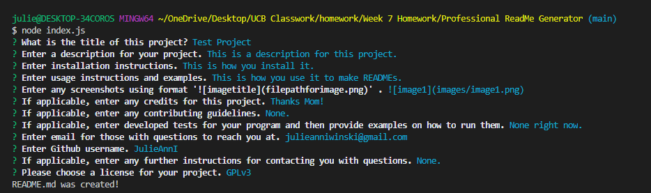

# Project

  ## Description
  
  This is a description.
  
  ## Table of Contents
  
  - [Installation](#Installation)
  - [Usage](#Usage)
  - [Credits](#Credits)
  - [Contributing](#Contributing)
  - [Questions](#Questions)
  - [License](#License)
  - [Tests](#Tests)
  
  ## Installation
  
  This are the instructions.
  
  ## Usage
  
  You can use this to make READMEs.
  
  
  ## Credits
  
  Thanks Mom!
  
  ## Contributing 
  
  Don't do it.
  
  ## Questions
  
  To ask questions about this project please contact me through the following sources:
  - Email: julieanniwinski@gmail.com
  - Github:  https://github.com/JulieAnnI
  
  Feel free to contact me anytime!
  
  ## License
  
  Copyright (c)  JulieAnnI.
    This project is [Apache]((https://opensource.org/licenses/Apache-2.0)) licensed. 
    [] 
  
  ## Tests
  
  None right now.